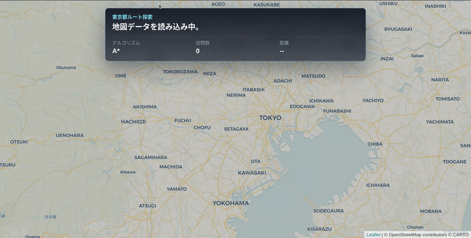

# Tokyo A* Route Visualizer

東京23区の道路データで、A*のルート探索をアニメーション表示するミニプロジェクトです。



## できること

- OpenStreetMapベースの道路グラフを表示
- A*で最短ルートを探索
- 探索中のノードと最終ルートをアニメーションで可視化
- Dijkstraにも切り替え可能

## 使い方

```bash
python3 -m http.server 8000
```

```text
http://127.0.0.1:8000/
```

## Tech

HTML / CSS / JavaScript / Leaflet / OpenStreetMap
